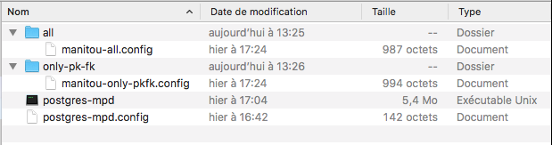

# Postgres-MPD (French)

## Préparation de l'environnement de build

Pour compiler il faut d'abord installer un environnement GoLang, pour cela se rendre sur le site officiel [*https://golang.org/dl/*](https://golang.org/dl/) afin de le télécharger.

La compilation de l'utilitaire demande d'avoir la librairie PostgreSQL installée pour cela se placer dans un répertoire, par exemple votre HOME et récupérer la librairie.

   -   cd ~/
   -   mkdir GoTools && cd GoTools/
   -   mkdir bin pkg src
   -   export GOPATH=`pwd`
   -   go get -u github.com/lib/pq

## Compilation

La compilation va se faire dans le répertoire ou vous allez cloner le projet, par exemple si c'est dans votre HOME

   -   cd ~/
   -   git clone .... (reprendre l'URL indiquée par github)
   -   cd Postgres-MPD/GoWork
   -   export GOPATH=~/GoTools/:`pwd`
   -   go build postgres-mpd

## Installation

Il suffit de copier le binaire dans le répertoire Postgres-MPD/Example/Manitou/

## Configuration

Il est nécessaire de configurer au moins deux fichiers, la syntaxe des fichiers de configuration est du JSON. Deux exemples sont fournis dans le répertoire Example, respecter l'architecture des répertoires.

### fichier postgres-mpd.config

Ce fichier décrit comment se connecter à la base de donnnées PostgreSQL, on y retrouve les informations classiques de connection à toute base PostgreSQL.

### Créer un répertoire de génération

Dans l'Example nous en trouvons deux

   -   all, dans lequel on va trouver un exemple de configuration pour générer le graphique de toutes les tables en incluant toutes les colonnes de chaque table.
   -   only-pk-fk, dans lequel on va trouver un exemple de configuration pour générer le graphique de toutes les tables en incluant que les colonnes de type primary et foreign key.

Dans votre répertoire recopier un des deux fichiers de configuration (all/manitou-all.config ou only-pk-fk/manitou-only-pkfk.config)

#### Voici un exemple d'installation.

## Utilisation

Extract and draw tables relations graph from existing Postgres database 

Ok
