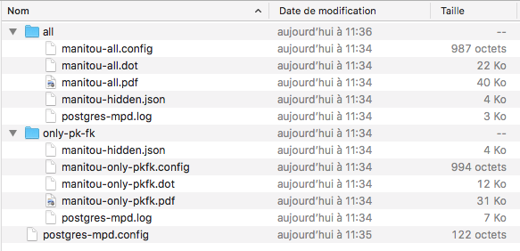

# Postgres-MPD (French)

## Préparation de l'environnement de build

Pour compiler il faut d'abord installer un environnement GoLang, pour cela se rendre sur le site officiel [*https://golang.org/dl/*](https://golang.org/dl/) afin de le télécharger.

La compilation de l'utilitaire demande d'avoir la librairie PostgreSQL installée pour cela se placer dans un répertoire, par exemple votre HOME et récupérer la librairie.

   -   cd ~/
   -   mkdir GoTools && cd GoTools/
   -   mkdir bin pkg src
   -   export GOPATH=`pwd`
   -   go get -u github.com/lib/pq

## Compilation

La compilation va se faire dans le répertoire ou vous allez cloner le projet, par exemple si c'est dans votre HOME

   -   cd ~/
   -   git clone .... (reprendre l'URL indiquée par github)
   -   cd Postgres-MPD/GoWork
   -   export GOPATH=~/GoTools/:`pwd`
   -   go build postgres-mpd

## Installation

Il suffit de copier le binaire dans le répertoire Postgres-MPD/Example/Manitou/

## Configuration

Il est nécessaire de configurer au moins deux fichiers, la syntaxe des fichiers de configuration est du JSON. Deux exemples sont fournis dans le répertoire Example, respecter l'architecture des répertoires.

### fichier postgres-mpd.config

Ce fichier décrit comment se connecter à la base de donnnées PostgreSQL, on y retrouve les informations classiques de connection à toute base PostgreSQL.

### Créer un répertoire de génération

Dans l'Example nous en trouvons deux

   -   all, dans lequel on va trouver un exemple de configuration pour générer le graphique de toutes les tables en incluant toutes les colonnes de chaque table.
   -   only-pk-fk, dans lequel on va trouver un exemple de configuration pour générer le graphique de toutes les tables en incluant que les colonnes de type primary et foreign key.

Dans votre répertoire recopier un des deux fichiers de configuration (all/manitou-all.config ou only-pk-fk/manitou-only-pkfk.config)

#### Voici un exemple d'installation.


### fichier de configuration de l'extraction

Vous pouvez nommer ce fichier comme vous voulez, le placer dans le répertoire créé dans l'étape précédente et l'éditer pour le modifier.

#### Entrée "outputConfig"

```
	"outputConfig" : {
		"outputName" : "manitou-all",
		"dotOutputFormat" : "pdf",
		"dotBinary" : "/usr/local/bin/dot",
		"includePrimaryKeys" : true,
		"includeForeignKeys" : true,
		"includeDataColumns" : true
	}
```

   -   ***outputName*** nom utilisé pour générer les fichiers (dot, pdf, ...)
   -   ***dotOutputFormat*** format utilisé par la transformation graphviz/dot, [*https://www.graphviz.org/doc/info/output.html*](liste des formats supportés)
   -   ***dotBinary*** Chemin vers le binaire dot de Graphviz
   -   ***includePrimaryKeys*** true pour inclure les primary key lors de la génération
   -   ***includeForeignKeys*** true pour inclure les foreign key lors de la génération
   -   ***includeDataColumns*** true pour inclure les colonnes autre que primary key ou foreign key lors de la génération


#### Entrée "clusters"

```
	"clusters":[ {
			"name" : "Manitou",
			"background" : "bisque3",
			"show" : true,
			"content" : ["addresses","attachment_contents","attachments","body","filter_action","filter_expr","header","identities","import_mbox","inverted_word_index","mail","mail_addresses","mail_tags","mailing_data","mailing_definition","mailing_run","notes","raw_mail","tags","tags_words","words"]
		} , {
			"name" : "Technique",
			"background" : "cyan3",
			"show" : true,
			"content" : ["users","user_queries","runtime_info","programs","non_indexable_words","mime_types","mail_template","mail_status","jobs_queue","import_message","global_notepad","forward_addresses","filter_log","files","config"]
		} 
	]
```

Dans ce tableau il est possible de lister autant de "clusters" souhaité, un cluster est un moyen de rassembler des tables qui apparaitront dans un meme rectangle, il a un nom et une couleur de fond. Il est possible d'indiquer si il est visible ou masqué, un cluster masqué ses tables n'apparaitront pas dans la sortie. Dans le tableau "content" on indique la liste des tables qui font parties du cluster.

   -   ***name*** nom du cluster
   -   ***background*** couleur de fond du cluster [*https://www.graphviz.org/doc/info/colors.html*](liste des couleurs supportés)
   -   ***show*** true pour afficher le cluster et ses tables
   -   ***content*** listes des tables contenues dans le cluster

#### Entrée "hidden"

```
	"hidden":[
		{
			"tableName" : "foo",
			"columns": ["col1"]
		}
	]
```

Pour chaque table il va etre possible de masquer un ensemble de colonnes, pour cela indiquer le nom de la table et la liste des colonnes masquées.

   -   ***tableName*** nom de la table
   -   ***columns*** tableau des colonnes masquées

## Utilisation

### Execution sur la configuration générant le modele contenant toutes les colonnes de chaque table

`./postgres-mpd ./all manitou-all.config`

### Execution sur la configuration générant le modele contenant uniquement les colonnes de type primary et foreign key de chaque table

`./postgres-mpd only-pk-fk/ manitou-only-pkfk.config `

### Résultats une fois l'exécution terminée



## Exemple avec la base de Matitou

Comme exemple les fichiers de configuration pour Manitou-Mail sont disponibles. [*http://www.manitou-mail.org*](http://www.manitou-mail.org)
### PDF des tables avec toutes les colonnes
[Toutes les colonnes](https://github.com/ptro46/Postgres-MPD/blob/master/Example/Manitou/all/manitou-all.pdf)
### PDF des tables avec uniquement les primary et foreign key
[Uniquement les primary et foreign key](Example/Manitou/only-pk-fk/manitou-only-pkfk.pdf)
